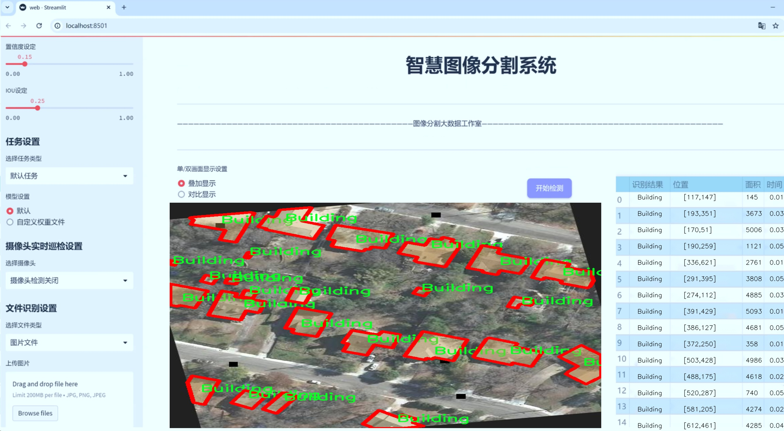
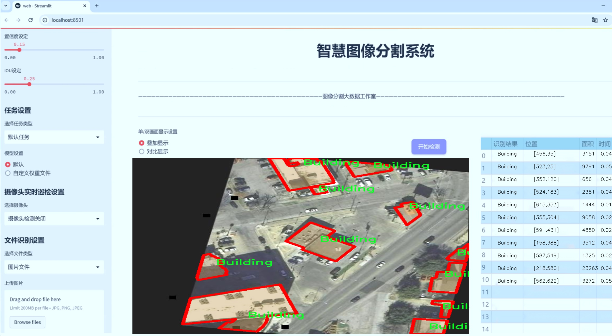
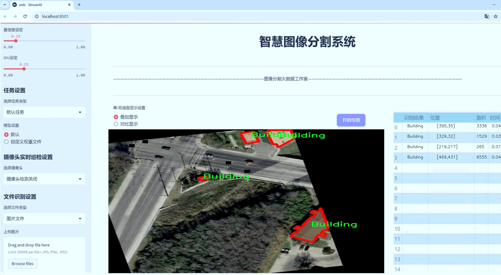
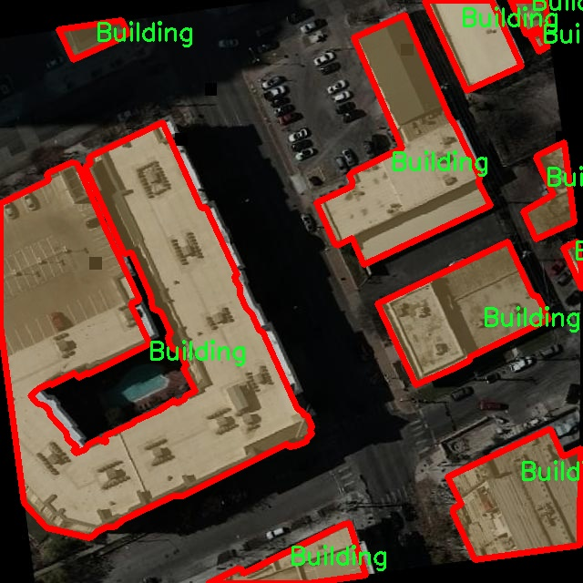
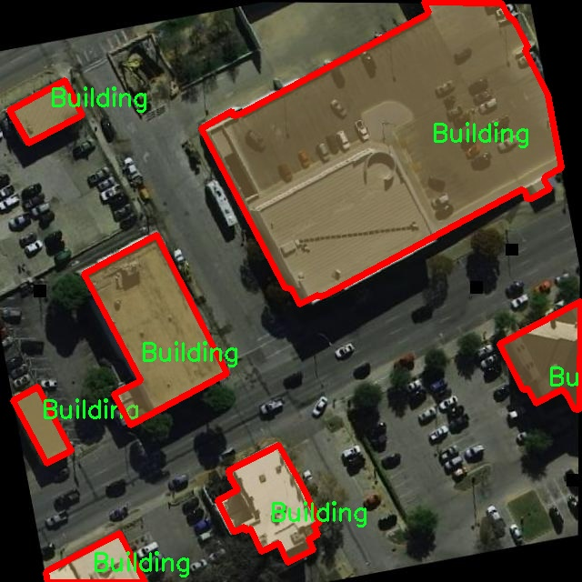
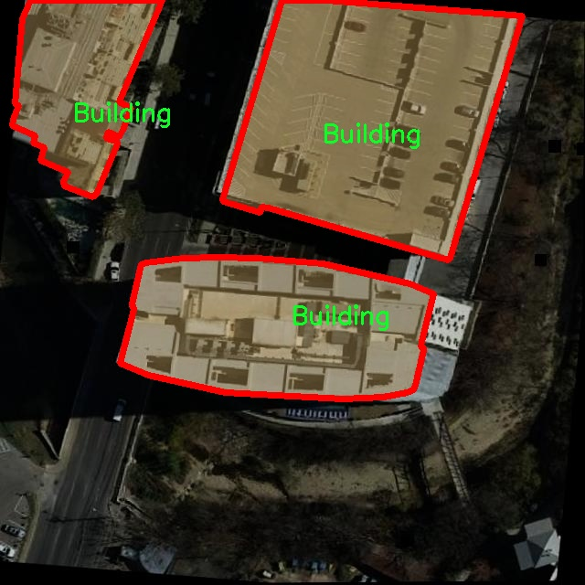
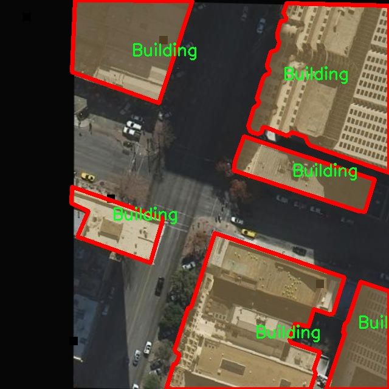
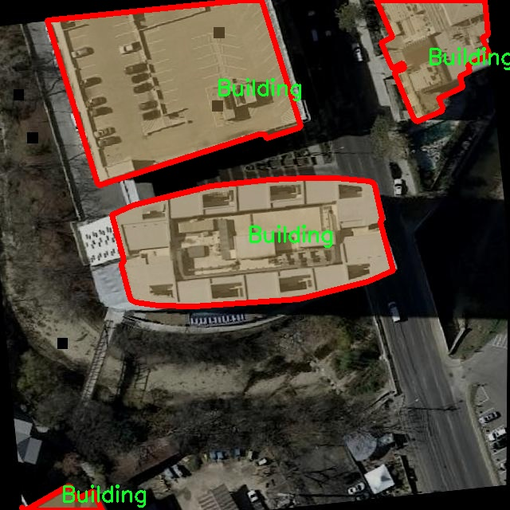

# 航拍建筑物图像分割系统： yolov8-seg-p6

### 1.研究背景与意义

[参考博客](https://gitee.com/YOLOv8_YOLOv11_Segmentation_Studio/projects)

[博客来源](https://kdocs.cn/l/cszuIiCKVNis)

研究背景与意义

随着城市化进程的加速，建筑物的数量和复杂性日益增加，如何高效、准确地进行建筑物的识别与分割成为了计算机视觉领域的重要研究课题。航拍技术的快速发展为建筑物的监测与管理提供了新的视角和手段，尤其是在城市规划、灾后重建、环境监测等领域，航拍图像的应用愈发广泛。然而，传统的图像处理方法在处理复杂场景时往往面临着识别精度低、处理速度慢等问题。因此，基于深度学习的图像分割技术应运而生，并逐渐成为该领域的研究热点。

YOLO（You Only Look Once）系列模型因其高效的实时目标检测能力而受到广泛关注。YOLOv8作为该系列的最新版本，进一步提升了模型的精度和速度，适用于多种应用场景。然而，尽管YOLOv8在目标检测方面表现出色，但在建筑物的实例分割任务中仍存在一定的局限性，尤其是在复杂背景、遮挡物以及光照变化等情况下。因此，针对航拍建筑物图像的特定需求，对YOLOv8进行改进，提升其在建筑物实例分割中的表现，具有重要的理论和实践意义。

本研究将构建一个基于改进YOLOv8的航拍建筑物图像分割系统，旨在通过优化模型结构和训练策略，提高建筑物分割的精度和鲁棒性。所使用的数据集包含9700幅航拍建筑物图像，涵盖了丰富的建筑物实例，能够为模型的训练和验证提供充分的数据支持。该数据集的单一类别“建筑物”使得模型能够专注于建筑物的特征提取，避免了多类别任务中可能出现的干扰，从而提升了分割效果。

此外，建筑物的实例分割不仅仅是一个技术问题，更是一个关乎城市管理和可持续发展的重要议题。通过准确的建筑物分割，可以为城市规划提供科学依据，帮助决策者更好地进行资源配置和环境保护。同时，在灾后重建中，快速识别受损建筑物的位置和状态，能够为救援工作提供及时的信息支持，提升救援效率。因此，基于改进YOLOv8的航拍建筑物图像分割系统的研究，不仅具有学术价值，更具备广泛的社会应用前景。

综上所述，本研究在理论和实践层面均具有重要意义。通过对YOLOv8的改进，结合航拍建筑物图像的特征，能够推动建筑物实例分割技术的发展，提升其在实际应用中的有效性。同时，该研究成果将为相关领域的研究者提供参考，促进计算机视觉技术在城市管理、环境监测等方面的深入应用，助力实现智能城市的愿景。

### 2.图片演示







注意：本项目提供完整的训练源码数据集和训练教程,由于此博客编辑较早,暂不提供权重文件（best.pt）,需要按照6.训练教程进行训练后实现上图效果。

### 3.视频演示

[3.1 视频演示](https://www.bilibili.com/video/BV1zuUQYBEJX/)

### 4.数据集信息

##### 4.1 数据集类别数＆类别名

nc: 1
names: ['Building']


##### 4.2 数据集信息简介

数据集信息展示

在本研究中，我们采用了名为“Buildings Instance Segmentation”的数据集，以支持改进YOLOv8-seg的航拍建筑物图像分割系统的训练和评估。该数据集专注于建筑物实例的分割，旨在为自动化建筑物识别和分析提供高质量的标注数据。数据集的设计考虑到了航拍图像的特性，确保其在实际应用中的有效性和可靠性。

“Buildings Instance Segmentation”数据集包含了丰富的航拍图像，所有图像均经过精确的标注，确保每一栋建筑物都被清晰地分割和标识。该数据集的类别数量为1，具体类别为“Building”。这一设计反映了我们研究的重点，即专注于建筑物的实例分割，而不涉及其他可能的地物类别。这种专一性使得模型能够在训练过程中更好地学习到建筑物的特征，从而提高分割的准确性和鲁棒性。

在数据集的构建过程中，研究团队采集了来自不同地区和环境的航拍图像，确保数据的多样性和代表性。这些图像涵盖了城市、乡村、商业区等多种场景，展示了不同类型建筑物的外观和结构特征。通过这种多样化的样本选择，数据集不仅增强了模型的泛化能力，还为后续的实际应用提供了更为广泛的适用性。

为了确保数据集的高质量，所有图像均经过专业的标注流程。标注团队使用了先进的图像处理工具，对每一幅图像中的建筑物进行精确的轮廓描绘，形成了清晰的分割标注。这些标注信息为YOLOv8-seg模型的训练提供了必要的监督信号，使得模型能够有效地学习到建筑物的边界和形状特征。

此外，数据集还考虑到了不同光照条件和天气变化对建筑物识别的影响。通过在不同时间和环境下拍摄的图像，数据集涵盖了晴天、阴天、雨天等多种气候条件下的建筑物图像。这种设计不仅增强了数据集的实用性，也为模型在复杂环境下的表现提供了更为全面的训练基础。

在模型训练过程中，我们将采用数据增强技术，以进一步提升模型的鲁棒性和适应性。通过对原始图像进行旋转、缩放、裁剪等操作，生成更多的训练样本，帮助模型更好地应对实际应用中可能遇到的各种变换和干扰。这种方法将有助于提高模型在真实场景中的表现，确保其在建筑物实例分割任务中的有效性。

总之，“Buildings Instance Segmentation”数据集为改进YOLOv8-seg的航拍建筑物图像分割系统提供了坚实的基础。通过精确的标注、多样化的样本和有效的数据增强策略，该数据集不仅能够提升模型的训练效果，还能为后续的实际应用提供强有力的支持。我们期待通过这一数据集的应用，推动建筑物图像分割技术的发展，为城市规划、建筑管理等领域提供更为智能化的解决方案。











### 5.项目依赖环境部署教程（零基础手把手教学）

[5.1 环境部署教程链接（零基础手把手教学）](https://www.bilibili.com/video/BV1jG4Ve4E9t/?vd_source=bc9aec86d164b67a7004b996143742dc)


[5.2 安装Python虚拟环境创建和依赖库安装视频教程链接（零基础手把手教学）](https://www.bilibili.com/video/BV1nA4VeYEze/?vd_source=bc9aec86d164b67a7004b996143742dc)

### 6.手把手YOLOV8-seg训练视频教程（零基础手把手教学）

[6.1 手把手YOLOV8-seg训练视频教程（零基础小白有手就能学会）](https://www.bilibili.com/video/BV1cA4VeYETe/?vd_source=bc9aec86d164b67a7004b996143742dc)


按照上面的训练视频教程链接加载项目提供的数据集，运行train.py即可开始训练



     Epoch   gpu_mem       box       obj       cls    labels  img_size
     1/200     0G   0.01576   0.01955  0.007536        22      1280: 100%|██████████| 849/849 [14:42<00:00,  1.04s/it]
               Class     Images     Labels          P          R     mAP@.5 mAP@.5:.95: 100%|██████████| 213/213 [01:14<00:00,  2.87it/s]
                 all       3395      17314      0.994      0.957      0.0957      0.0843

     Epoch   gpu_mem       box       obj       cls    labels  img_size
     2/200     0G   0.01578   0.01923  0.007006        22      1280: 100%|██████████| 849/849 [14:44<00:00,  1.04s/it]
               Class     Images     Labels          P          R     mAP@.5 mAP@.5:.95: 100%|██████████| 213/213 [01:12<00:00,  2.95it/s]
                 all       3395      17314      0.996      0.956      0.0957      0.0845

     Epoch   gpu_mem       box       obj       cls    labels  img_size
     3/200     0G   0.01561    0.0191  0.006895        27      1280: 100%|██████████| 849/849 [10:56<00:00,  1.29it/s]
               Class     Images     Labels          P          R     mAP@.5 mAP@.5:.95: 100%|███████   | 187/213 [00:52<00:00,  4.04it/s]
                 all       3395      17314      0.996      0.957      0.0957      0.0845


### 7.50+种全套YOLOV8-seg创新点加载调参实验视频教程（一键加载写好的改进模型的配置文件）

[7.1 50+种全套YOLOV8-seg创新点加载调参实验视频教程（一键加载写好的改进模型的配置文件）](https://www.bilibili.com/video/BV1Hw4VePEXv/?vd_source=bc9aec86d164b67a7004b996143742dc)

### YOLOV8-seg算法简介

原始YOLOV8-seg算法原理

YOLOv8-seg算法是2023年由Ultralytics公司推出的YOLO系列中的最新版本，旨在通过改进目标检测和分割技术，提升计算机视觉任务的效率和准确性。该算法在YOLOv7的基础上进行了多项优化，采用了更深的卷积神经网络结构，使得模型在处理复杂场景时表现得更加出色。YOLOv8-seg不仅能够进行目标检测，还能实现精细的图像分割，适用于多种应用场景，如智能监控、自动驾驶和医学影像分析等。

YOLOv8-seg的核心在于其创新的网络架构和高效的特征提取机制。首先，YOLOv8-seg引入了C2f模块，替代了YOLOv5中的C3模块。C2f模块通过对特征图进行更为灵活的处理，增强了模型对不同尺度目标的检测能力。该模块的设计使得特征提取过程更加高效，能够在保持高精度的同时，减少计算资源的消耗。此外，YOLOv8-seg的主干网络采用了CSP（Cross Stage Partial）结构，这一结构将特征提取过程分为两部分，分别进行卷积和连接，从而实现更深层次的特征学习。这种分离式的特征提取方式不仅提高了模型的表达能力，还有效缓解了梯度消失的问题，使得网络在训练过程中更加稳定。

在特征融合方面，YOLOv8-seg采用了PAN-FPN（Path Aggregation Network - Feature Pyramid Network）结构，能够在不同尺度上进行特征的多层次融合。这一设计使得模型能够更好地捕捉到目标的上下文信息，从而提升了对小目标和复杂背景的检测能力。通过多尺度特征的融合，YOLOv8-seg在处理图像时能够综合考虑不同层次的信息，增强了模型的鲁棒性。

YOLOv8-seg在检测网络的设计上也进行了创新，采用了Anchor-Free的检测方式。这一方法省去了传统目标检测算法中依赖于锚框的步骤，使得模型在目标定位时更加灵活。YOLOv8-seg的Detect模块使用了解耦头结构，这种结构将目标分类和边界框回归任务进行了分离，使得模型在进行目标检测时能够更加专注于每个任务的优化，从而提升了整体的检测性能。此外，YOLOv8-seg使用的损失函数CloU（Class-Location Uncertainty）进一步提高了模型在目标检测中的精度，尤其是在面对复杂场景时，能够有效降低误检和漏检的概率。

在训练过程中，YOLOv8-seg引入了多尺度训练和测试策略。这一策略通过在不同尺度下对模型进行训练，使得模型能够适应各种尺寸的目标，增强了其在实际应用中的适用性。同时，YOLOv8-seg还利用了特征金字塔网络（FPN）技术，使得模型在处理多尺度目标时能够更加高效。通过这种方式，YOLOv8-seg在目标检测和分割任务中实现了更高的精度和更快的推理速度。

总的来说，YOLOv8-seg算法通过一系列的结构优化和技术创新，显著提升了目标检测和分割的性能。与之前的YOLO版本相比，YOLOv8-seg在精度和速度上都有了显著的提升，能够更好地满足实际应用中的需求。无论是在智能监控、自动驾驶还是其他计算机视觉任务中，YOLOv8-seg都展现出了强大的能力和广泛的应用前景。其高效的特征提取、灵活的检测机制以及强大的多尺度融合能力，使得YOLOv8-seg成为当前目标检测和分割领域的重要工具，为相关研究和应用提供了坚实的基础。


### 9.系统功能展示（检测对象为举例，实际内容以本项目数据集为准）

图9.1.系统支持检测结果表格显示

  图9.2.系统支持置信度和IOU阈值手动调节

  图9.3.系统支持自定义加载权重文件best.pt(需要你通过步骤5中训练获得)

  图9.4.系统支持摄像头实时识别

  图9.5.系统支持图片识别

  图9.6.系统支持视频识别

  图9.7.系统支持识别结果文件自动保存

  图9.8.系统支持Excel导出检测结果数据


### 10.50+种全套YOLOV8-seg创新点原理讲解（非科班也可以轻松写刊发刊，V11版本正在科研待更新）

#### 10.1 由于篇幅限制，每个创新点的具体原理讲解就不一一展开，具体见下列网址中的创新点对应子项目的技术原理博客网址【Blog】：


[10.1 50+种全套YOLOV8-seg创新点原理讲解链接](https://gitee.com/qunmasj/good)

#### 10.2 部分改进模块原理讲解(完整的改进原理见上图和技术博客链接)【如果此小节的图加载失败可以通过CSDN或者Github搜索该博客的标题访问原始博客，原始博客图片显示正常】

### YOLOv8简介
#### YOLOv8是什么？
YOLOv8是Ultralytics公司推出的基于对象检测模型的YOLO最新系列，它能够提供截至目前最先进的对象检测性能。

借助于以前的YOLO模型版本支持技术，YOLOv8模型运行得更快、更准确，同时为执行任务的训练模型提供了统一的框架，这包括：

目标检测
实例分割
图像分类
在撰写本文时，Ultralytics的YOLOv8存储库中其实还有很多功能有待添加，这包括训练模型的整套导出功能等。此外，Ultralytics将计划在Arxiv上发布一篇相关的论文，将对YOLOv8与其他最先进的视觉模型进行比较。

#### YOLOv8的新功能
Ultralytics为YOLO模型发布了一个全新的存储库（https://github.com/ultralytics/ultralytics）。该存储库被构建为用于训练对象检测、实例分割和图像分类模型的统一框架。

以下列举的是这个新版本的一些关键功能：

用户友好的API（命令行+Python）。
更快、更准确。
支持：
目标检测，
实例分割和
图像分类。
可扩展到所有以前的版本。
新的骨干网络。
新的Anchor-Free head对象检测算法。
新的损失函数。
此外，YOLOv8也非常高效和灵活，它可以支持多种导出格式，而且该模型可以在CPU和GPU上运行。

#### YOLOv8中提供的子模型


YOLOv8模型的每个类别中共有五个模型，以便共同完成检测、分割和分类任务。其中，YOLOv8 Nano是最快和最小的模型，而YOLOv8Extra Large（YOLOv8x）是其中最准确但最慢的模型。

YOLOv8这次发行中共附带了以下预训练模型：

在图像分辨率为640的COCO检测数据集上训练的对象检测检查点。
在图像分辨率为640的COCO分割数据集上训练的实例分割检查点。
在图像分辨率为224的ImageNet数据集上预处理的图像分类模型。
### 高效网络架构 CloAtt简介
众所周知，自从 ViTs 提出后，Transformer 基本横扫各大 CV 主流任务，包括视觉识别、目标检测和语义分割等。然而，一个比较棘手的问题就是这个架构参数量和计算量太大，所以一直被广受诟病。因此，后续有不少工作都是朝着这个方向去改进，例如 Swin-Transformer 在局部非重叠窗口中进行注意力计算，而 PVT 中则是使用平均池化来合并 token 以进一步压缩耗时。然而，这些 ViTs 由于其参数量太大以及高 FLOPs 并不适合部署到移动设备。如果我们直接缩小到适合移动设备的尺寸时，它们的性能又会显著降低。


#### MobileViT
因此，出现了不少工作聚焦于探索轻量级的视觉变换器，使 ViTs 适用于移动设备，CVHub 此前也介绍过不少的工作，大家有兴趣可以翻阅历史文章读读。例如，苹果团队提出的 MobileViT 研究了如何将 CNN 与 Transformer 相结合，而另一个工作 MobileFormer 则将轻量级的 MobileNet 与 Transformer 进行融合。此外，最新提出的 EdgeViT 提出了一个局部-全局-局部模块来聚合信息。以上工作的目标都是设计具有高性能、较少参数和低 FLOPs 的移动端友好型模型。


#### EdgeViT
然而，作者从频域编码的角度认为，在现有的轻量级模型中，大多数方法只关注设计稀疏注意力，以有效地处理低频全局信息，而使用相对简单的方法处理高频局部信息。具体而言，大多数模型如 EdgeViT 和 MobileViT，只是简单使用原始卷积提取局部表示，这些方法仅使用卷积中的全局共享权重处理高频本地信息。其他方法，如 LVT ，则是首先将标记展开到窗口中，然后使用窗口内的注意力获得高频信息。这些方法仅使用特定于每个 Token 的上下文感知权重进行局部感知。


#### LVT
虽然上述轻量级模型在多个数据集上取得了良好的结果，但没有一种方法尝试设计更有效的方法，即利用共享和上下文感知权重的优势来处理高频局部信息。基于共享权重的方法，如传统的卷积神经网络，具有平移等变性的特征。与它们不同，基于上下文感知权重的方法，如 LVT 和 NAT，具有可以随输入内容变化的权重。这两种类型的权重在局部感知中都有自己的优势。
#### NAT


受该博客的启发，本文设计了一种轻量级视觉变换器——CloAtt，其利用了上下文感知的局部增强。特别地，CloAtt 采用了双分支设计结构。
#### 局部分支
在局部分支中，本文引入了一个精心设计的 AttnConv，一种简单而有效的卷积操作符，它采用了注意力机制的风格。所提出的 AttnConv 有效地融合了共享权重和上下文感知权重，以聚合高频的局部信息。具体地，AttnConv 首先使用深度卷积（DWconv）提取局部表示，其中 DWconv 具有共享权重。然后，其使用上下文感知权重来增强局部特征。与 Non-Local 等生成上下文感知权重的方法不同，AttnConv 使用门控机制生成上下文感知权重，引入了比常用的注意力机制更强的非线性。此外，AttnConv 将卷积算子应用于 Query 和 Key 以聚合局部信息，然后计算 Q 和 K 的哈达玛积，并对结果进行一系列线性或非线性变换，生成范围在 [-1,1] 之间的上下文感知权重。值得注意的是，AttnConv 继承了卷积的平移等变性，因为它的所有操作都基于卷积。
#### 全局分支
在全局分支中则使用了传统的注意力机制，但对 K 和 V 进行了下采样以减少计算量，从而捕捉低频全局信息。最后，CloFormer 通过简单的方法将局部分支和全局分支的输出进行融合，从而使模型能够同时捕捉高频和低频信息。总的来说，CloFormer 的设计能够同时发挥共享权重和上下文感知权重的优势，提高其局部感知的能力，使其在图像分类、物体检测和语义分割等多个视觉任务上均取得了优异的性能。
如上图2所示，CloFormer 共包含一个卷积主干和四个 stage，每个 stage you Clo 模块 和 ConvFFN 组合而成的模块堆叠而成 。具体得，首先将输入图像通过卷积主干传递，以获取 token 表示。该主干由四个卷积组成，每个卷积的步长依次为2、2、1和1。接下来，tokens 经历四个 Clo 块和 ConvFFN 阶段，以提取分层特征。最后，再利用全局平均池化和全连接层生成预测结果。可以看出，整个架构非常简洁，支持即插即用！


#### ConvFFN
为了将局部信息融入 FFN 过程中，本文采用 ConvFFN 替换了常用的 FFN。ConvFFN 和常用的 FFN 的主要区别在于，ConvFFN 在 GELU 激活函数之后使用了深度卷积（DWconv），从而使 ConvFFN 能够聚合局部信息。由于DWconv 的存在，可以直接在 ConvFFN 中进行下采样而不需要引入 PatchMerge 模块。CloFormer 使用了两种ConvFFN。第一种是在阶段内的 ConvFFN，它直接利用跳跃连接。另一种是连接两个阶段的 ConvFFN，主要用于下采样操作。
#### Clo block
CloFormer 中的 Clo块 是非常关键的组件。每个 Clo 块由一个局部分支和一个全局分支组成。在全局分支中，我们首先下采样 K 和 V，然后对 Q、K 和 V 进行标准的 attention 操作，以提取低频全局信息。
虽然全局分支的设计能够有效减少注意力机制所需的浮点运算次数，并且能够获得全局的感受野。然而，它在处理高频局部信息方面的能力不足。为了解决这个问题，CloFormer 引入了局部分支，并使用 AttnConv 对高频局部信息进行处理。AttnConv 可以融合共享权重和上下文感知权重，能够更好地处理高频局部信息。因此，CloFormer 结合了全局和局部的优势来提高图像分类性能。下面我们重点讲下 AttnConv 。
#### AttnConv
AttnConv 是一个关键模块，使得所提模型能够获得高性能。它结合了一些标准的 attention 操作。具体而言，在AttnConv 中，我们首先进行线性变换以获得 Q、K和V。在进行线性变换之后，我们再对 V 进行共享权重的局部特征聚合。然后，基于处理后的 V 和 Q ，K 进行上下文感知的局部增强。具体流程可对照流程图理解，我们可以将其拆解成三个步骤。
#### Local Feature Aggregation
为了简单起见，本文直接使用一个简单的深度卷积（DWconv）来对 V 进行局部信息聚合。
#### Context-aware Local Enhancement
在将具有共享权重的局部信息整合到 V 中后，我们结合 Q 和 K 生成上下文感知权重。值得注意的是，我们使用了与局部自注意力不同的方法，该方法更加简洁。具体而言，我们首先使用两个 DWconv 对 Q 和 K 分别进行局部信息聚合。然后，我们计算 Q 和 K 的 Hadamard 乘积，并对结果进行一系列转换，以获取在 -1 到 1 之间的上下文感知权重。最后，我们使用生成的权重来增强局部特征。
#### Fusion with Global Branch
在整个 CloFormer 中，我们使用一种简单直接的方法来将局部分支和全局分支的输出进行融合。具体而言，本文是通过将这两个输出在通道维度上进行直接拼接，然后再通过一个 FC 层聚合这些特征并结合残差输出。
最后，上图展示了三种不同的方法。相比于传统卷积，AttnConv 中的上下文感知权重使得模型能够更好地适应输入内容。相比于局部自注意力机制，引入共享权重使得模型能够更好地处理高频信息，从而提高性能。此外，生成上下文感知权重的方法引入了更强的非线性性，也提高了性能。需要注意的是，AttnConv 中的所有操作都基于卷积，保持了卷积的平移等变性特性。


### 11.项目核心源码讲解（再也不用担心看不懂代码逻辑）

#### 11.1 ultralytics\engine\model.py

以下是经过简化和注释的代码，保留了核心部分并添加了详细的中文注释：

```python
import torch
from pathlib import Path
from typing import Union
from ultralytics.nn.tasks import nn, attempt_load_one_weight, guess_model_task, yaml_model_load
from ultralytics.utils import callbacks, checks, ASSETS, LOGGER

class Model(nn.Module):
    """
    YOLO模型的基础类，统一所有模型的API。

    参数:
        model (str, Path): 要加载或创建的模型文件路径。
        task (Any, optional): YOLO模型的任务类型。默认为None。
    """

    def __init__(self, model: Union[str, Path] = 'yolov8n.pt', task=None) -> None:
        """
        初始化YOLO模型。

        参数:
            model (Union[str, Path], optional): 要加载或创建的模型路径或名称。默认为'yolov8n.pt'。
            task (Any, optional): YOLO模型的任务类型。默认为None。
        """
        super().__init__()
        self.model = None  # 模型对象
        self.task = task  # 任务类型
        model = str(model).strip()  # 去除空格

        # 加载或创建新的YOLO模型
        suffix = Path(model).suffix
        if suffix in ('.yaml', '.yml'):
            self._new(model, task)  # 从配置文件创建新模型
        else:
            self._load(model, task)  # 从权重文件加载模型

    def _new(self, cfg: str, task=None):
        """
        从配置文件初始化新模型并推断任务类型。

        参数:
            cfg (str): 模型配置文件
            task (str | None): 模型任务
        """
        cfg_dict = yaml_model_load(cfg)  # 加载yaml配置
        self.task = task or guess_model_task(cfg_dict)  # 推断任务类型
        self.model = self._smart_load('model')(cfg_dict)  # 创建模型

    def _load(self, weights: str, task=None):
        """
        从权重文件初始化新模型并推断任务类型。

        参数:
            weights (str): 要加载的模型权重
            task (str | None): 模型任务
        """
        self.model, _ = attempt_load_one_weight(weights)  # 加载权重
        self.task = self.model.args['task']  # 获取任务类型

    def predict(self, source=None, **kwargs):
        """
        使用YOLO模型进行预测。

        参数:
            source (str | int | PIL | np.ndarray): 进行预测的图像来源。
            **kwargs: 传递给预测器的其他关键字参数。

        返回:
            (List[ultralytics.engine.results.Results]): 预测结果。
        """
        if source is None:
            source = ASSETS  # 默认使用ASSETS作为源
            LOGGER.warning(f"WARNING ⚠️ 'source' is missing. Using 'source={source}'.")

        # 进行预测
        return self.model.predict(source=source, **kwargs)

    def _check_is_pytorch_model(self):
        """检查模型是否为PyTorch模型，如果不是则抛出TypeError。"""
        if not isinstance(self.model, nn.Module):
            raise TypeError(f"model='{self.model}' should be a PyTorch model.")

    @property
    def device(self):
        """返回模型所在的设备。"""
        return next(self.model.parameters()).device if isinstance(self.model, nn.Module) else None

    def load(self, weights='yolov8n.pt'):
        """加载权重到模型中。"""
        self._check_is_pytorch_model()  # 检查模型类型
        self.model.load(weights)  # 加载权重
        return self

    def info(self, detailed=False):
        """
        记录模型信息。

        参数:
            detailed (bool): 是否显示详细信息。
        """
        self._check_is_pytorch_model()  # 检查模型类型
        return self.model.info(detailed=detailed)  # 获取模型信息

    def train(self, **kwargs):
        """
        在给定数据集上训练模型。

        参数:
            **kwargs (Any): 训练配置的任意数量的参数。
        """
        self._check_is_pytorch_model()  # 检查模型类型
        # 训练模型的逻辑
        # 省略具体实现
```

### 代码分析与注释
1. **类定义**: `Model`类继承自`nn.Module`，是YOLO模型的基础类，统一了模型的API。
2. **初始化方法**: `__init__`方法用于初始化模型，支持从权重文件或配置文件加载模型。
3. **模型加载**: `_load`和`_new`方法分别用于从权重文件和配置文件加载模型。
4. **预测方法**: `predict`方法用于进行图像预测，支持多种输入源。
5. **设备检查**: `device`属性返回模型所在的设备，方便后续操作。
6. **训练方法**: `train`方法用于训练模型，具体实现逻辑可以根据需要补充。

此代码保留了YOLO模型的核心功能，并添加了详细的中文注释，便于理解和使用。

这个文件是Ultralytics YOLO模型的核心实现部分，主要定义了一个名为`Model`的类，该类统一了YOLO模型的API，提供了模型的加载、训练、预测等功能。

在类的构造函数`__init__`中，首先调用父类的构造函数，然后初始化了一些属性，包括回调函数、模型对象、训练器对象、检查点等。接着根据传入的模型路径或名称，判断是否为Ultralytics HUB模型或Triton Server模型，并相应地进行处理。如果模型路径没有后缀，且是GitHub资产的一部分，则自动添加`.pt`后缀。根据模型的后缀，调用不同的方法来加载或创建模型。

类中定义了多个方法，其中`__call__`方法是对`predict`方法的别名，用于执行对象检测。`_new`和`_load`方法分别用于初始化新模型和加载已有模型的权重。`_check_is_pytorch_model`方法用于检查当前模型是否为PyTorch模型，如果不是则抛出错误。

模型的重置、信息获取、融合、预测、跟踪、验证、基准测试、导出和训练等功能都在类中得到了实现。`predict`方法用于执行预测，接受多种类型的输入源，并返回预测结果。`track`方法用于在输入源上执行对象跟踪。`val`方法用于在给定数据集上验证模型，返回验证结果。`benchmark`方法用于对模型在所有导出格式上的性能进行基准测试。

此外，类中还提供了超参数调优的功能，通过`tune`方法可以运行超参数调优，支持使用Ray Tune。`export`方法用于导出模型，`train`方法用于在给定数据集上训练模型。

类的属性中，`names`返回加载模型的类别名称，`device`返回模型所在的设备，`transforms`返回模型的变换操作。还提供了添加、清除和重置回调函数的方法。

最后，`_smart_load`方法用于加载模型、训练器、验证器和预测器，`task_map`属性用于映射模型任务到相应的类。

整体来看，这个文件实现了YOLO模型的核心功能，提供了灵活的接口以支持各种任务的执行，包括训练、验证、预测和导出等。

#### 11.2 ultralytics\models\sam\amg.py

以下是代码中最核心的部分，并附上详细的中文注释：

```python
import torch
from typing import List

def is_box_near_crop_edge(boxes: torch.Tensor,
                          crop_box: List[int],
                          orig_box: List[int],
                          atol: float = 20.0) -> torch.Tensor:
    """
    判断给定的边界框是否接近裁剪边缘。

    参数:
    boxes: 需要判断的边界框，格式为 (N, 4)，每个框由 [x1, y1, x2, y2] 表示。
    crop_box: 当前裁剪框的坐标 [x0, y0, x1, y1]。
    orig_box: 原始图像的边界框坐标 [x0, y0, x1, y1]。
    atol: 允许的绝对误差，默认为 20.0。

    返回:
    返回一个布尔张量，指示每个框是否接近裁剪边缘。
    """
    # 将裁剪框和原始框转换为张量
    crop_box_torch = torch.as_tensor(crop_box, dtype=torch.float, device=boxes.device)
    orig_box_torch = torch.as_tensor(orig_box, dtype=torch.float, device=boxes.device)
    
    # 将边界框从裁剪坐标系转换回原始坐标系
    boxes = uncrop_boxes_xyxy(boxes, crop_box).float()
    
    # 判断边界框是否接近裁剪框的边缘
    near_crop_edge = torch.isclose(boxes, crop_box_torch[None, :], atol=atol, rtol=0)
    # 判断边界框是否接近原始图像的边缘
    near_image_edge = torch.isclose(boxes, orig_box_torch[None, :], atol=atol, rtol=0)
    
    # 只保留接近裁剪边缘但不接近原始图像边缘的框
    near_crop_edge = torch.logical_and(near_crop_edge, ~near_image_edge)
    
    # 返回是否有框接近裁剪边缘
    return torch.any(near_crop_edge, dim=1)


def uncrop_boxes_xyxy(boxes: torch.Tensor, crop_box: List[int]) -> torch.Tensor:
    """
    将裁剪框的边界框转换回原始图像坐标系。

    参数:
    boxes: 裁剪后的边界框，格式为 (N, 4)，每个框由 [x1, y1, x2, y2] 表示。
    crop_box: 当前裁剪框的坐标 [x0, y0, x1, y1]。

    返回:
    返回转换后的边界框，格式为 (N, 4)。
    """
    x0, y0, _, _ = crop_box
    # 创建偏移量张量
    offset = torch.tensor([[x0, y0, x0, y0]], device=boxes.device)
    
    # 检查 boxes 是否有通道维度
    if len(boxes.shape) == 3:
        offset = offset.unsqueeze(1)
    
    # 返回转换后的边界框
    return boxes + offset


def batched_mask_to_box(masks: torch.Tensor) -> torch.Tensor:
    """
    计算掩膜周围的边界框，格式为 XYXY。

    参数:
    masks: 输入掩膜，格式为 CxHxW。

    返回:
    返回边界框，格式为 Cx4。
    """
    # 如果掩膜为空，返回 [0, 0, 0, 0]
    if torch.numel(masks) == 0:
        return torch.zeros(*masks.shape[:-2], 4, device=masks.device)

    # 规范化形状为 CxHxW
    shape = masks.shape
    h, w = shape[-2:]
    masks = masks.flatten(0, -3) if len(shape) > 2 else masks.unsqueeze(0)
    
    # 获取上边和下边的坐标
    in_height, _ = torch.max(masks, dim=-1)
    in_height_coords = in_height * torch.arange(h, device=in_height.device)[None, :]
    bottom_edges, _ = torch.max(in_height_coords, dim=-1)
    in_height_coords = in_height_coords + h * (~in_height)
    top_edges, _ = torch.min(in_height_coords, dim=-1)

    # 获取左边和右边的坐标
    in_width, _ = torch.max(masks, dim=-2)
    in_width_coords = in_width * torch.arange(w, device=in_width.device)[None, :]
    right_edges, _ = torch.max(in_width_coords, dim=-1)
    in_width_coords = in_width_coords + w * (~in_width)
    left_edges, _ = torch.min(in_width_coords, dim=-1)

    # 如果掩膜为空，右边界会在左边界的左侧
    empty_filter = (right_edges < left_edges) | (bottom_edges < top_edges)
    out = torch.stack([left_edges, top_edges, right_edges, bottom_edges], dim=-1)
    out = out * (~empty_filter).unsqueeze(-1)

    # 返回到原始形状
    return out.reshape(*shape[:-2], 4) if len(shape) > 2 else out[0]
```

### 代码核心部分说明：
1. **`is_box_near_crop_edge`**: 判断边界框是否接近裁剪边缘，返回布尔值。
2. **`uncrop_boxes_xyxy`**: 将裁剪后的边界框转换回原始图像坐标系。
3. **`batched_mask_to_box`**: 从掩膜计算边界框，返回边界框的坐标。 

这些函数在图像处理和目标检测中非常重要，特别是在处理裁剪图像和计算边界框时。

这个程序文件主要实现了一些与图像处理和目标检测相关的功能，尤其是在处理掩膜（masks）和边界框（boxes）方面。代码中使用了PyTorch和NumPy库，以下是对主要功能的详细说明。

首先，`is_box_near_crop_edge`函数用于判断给定的边界框是否接近裁剪边缘。它接收三个参数：`boxes`表示边界框，`crop_box`表示裁剪区域，`orig_box`表示原始边界框。函数通过将边界框从裁剪坐标系转换回原始坐标系，并检查它们是否接近裁剪边缘或图像边缘，返回一个布尔张量。

接下来的`batch_iterator`函数用于从输入参数中生成批次数据。它确保所有输入参数的长度相同，并根据指定的批次大小返回数据的子集。

`calculate_stability_score`函数计算一组掩膜的稳定性分数，具体是通过计算二进制掩膜在高阈值和低阈值下的交并比（IoU）来实现的。该函数通过对掩膜进行阈值处理，计算交集和并集的数量，从而得到稳定性分数。

`build_point_grid`和`build_all_layer_point_grids`函数用于生成均匀分布的二维点网格，后者为不同层级生成点网格，以便在图像处理过程中使用。

`generate_crop_boxes`函数生成不同大小的裁剪框，适用于多层次的图像处理。它根据图像的尺寸、层数和重叠比例计算每一层的裁剪框，并返回这些框及其对应的层索引。

`uncrop_boxes_xyxy`、`uncrop_points`和`uncrop_masks`函数用于将裁剪的边界框、点和掩膜转换回原始图像坐标系。这些函数通过添加裁剪框的偏移量来实现坐标的转换。

`remove_small_regions`函数用于移除掩膜中的小区域或孔洞。它使用OpenCV库中的连通组件分析来识别并处理小区域，返回处理后的掩膜和一个指示是否进行了修改的布尔值。

`batched_mask_to_box`函数计算掩膜周围的边界框，返回的格式为XYXY。它能够处理空掩膜的情况，并确保输出的形状与输入掩膜相匹配。

总体来说，这个程序文件提供了一系列工具，用于在图像处理和目标检测任务中处理掩膜和边界框，尤其是在裁剪和恢复图像时的相关操作。

#### 11.3 ultralytics\utils\atss.py

以下是经过简化并添加详细中文注释的核心代码部分：

```python
import torch
import torch.nn as nn
import torch.nn.functional as F

def bbox_overlaps(bboxes1, bboxes2, mode='iou', is_aligned=False, eps=1e-6):
    """计算两个边界框集合之间的重叠程度。

    参数:
        bboxes1 (Tensor): 形状为 (M, 4) 的边界框，格式为 <x1, y1, x2, y2>。
        bboxes2 (Tensor): 形状为 (N, 4) 的边界框，格式为 <x1, y1, x2, y2>。
        mode (str): 计算方式，可以是 "iou"（交并比）、"iof"（前景交集）或 "giou"（广义交并比）。
        is_aligned (bool): 如果为 True，则 bboxes1 和 bboxes2 的数量必须相等。
        eps (float): 为了数值稳定性而添加的值，默认值为 1e-6。

    返回:
        Tensor: 如果 `is_aligned` 为 False，返回形状为 (M, N) 的重叠矩阵；否则返回形状为 (M,) 的重叠向量。
    """
    assert mode in ['iou', 'iof', 'giou'], f'不支持的模式 {mode}'
    assert (bboxes1.size(-1) == 4 or bboxes1.size(0) == 0)
    assert (bboxes2.size(-1) == 4 or bboxes2.size(0) == 0)

    # 获取边界框的数量
    rows = bboxes1.size(-2)
    cols = bboxes2.size(-2)
    if is_aligned:
        assert rows == cols

    if rows * cols == 0:
        return bboxes1.new_zeros((rows, cols)) if not is_aligned else bboxes1.new_zeros((rows,))

    # 计算每个边界框的面积
    area1 = (bboxes1[..., 2] - bboxes1[..., 0]) * (bboxes1[..., 3] - bboxes1[..., 1])
    area2 = (bboxes2[..., 2] - bboxes2[..., 0]) * (bboxes2[..., 3] - bboxes2[..., 1])

    # 计算重叠区域的左上角和右下角坐标
    lt = torch.max(bboxes1[..., :2], bboxes2[..., :2])  # [B, rows, 2]
    rb = torch.min(bboxes1[..., 2:], bboxes2[..., 2:])  # [B, rows, 2]

    # 计算重叠区域的宽和高
    wh = (rb - lt).clamp(min=0)  # 防止负值
    overlap = wh[..., 0] * wh[..., 1]  # 计算重叠面积

    # 计算并集
    union = area1 + area2 - overlap + eps  # 加上 eps 防止除零
    ious = overlap / union  # 计算 IoU

    return ious  # 返回 IoU

class ATSSAssigner(nn.Module):
    '''自适应训练样本选择分配器'''
    def __init__(self, topk=9, num_classes=80):
        super(ATSSAssigner, self).__init__()
        self.topk = topk  # 每个级别选择的最大候选框数量
        self.num_classes = num_classes  # 类别数量
        self.bg_idx = num_classes  # 背景类别索引

    @torch.no_grad()
    def forward(self, anc_bboxes, n_level_bboxes, gt_labels, gt_bboxes, mask_gt, pd_bboxes):
        """前向传播函数，计算目标框的分配。

        参数:
            anc_bboxes (Tensor): 形状为 (num_total_anchors, 4) 的锚框。
            n_level_bboxes (List): 每个级别的边界框数量。
            gt_labels (Tensor): 形状为 (bs, n_max_boxes, 1) 的真实标签。
            gt_bboxes (Tensor): 形状为 (bs, n_max_boxes, 4) 的真实边界框。
            mask_gt (Tensor): 形状为 (bs, n_max_boxes, 1) 的掩码。
            pd_bboxes (Tensor): 形状为 (bs, n_max_boxes, 4) 的预测边界框。

        返回:
            target_labels (Tensor): 形状为 (bs, num_total_anchors) 的目标标签。
            target_bboxes (Tensor): 形状为 (bs, num_total_anchors, 4) 的目标边界框。
            target_scores (Tensor): 形状为 (bs, num_total_anchors, num_classes) 的目标分数。
            fg_mask (Tensor): 形状为 (bs, num_total_anchors) 的前景掩码。
        """
        self.n_anchors = anc_bboxes.size(0)  # 锚框数量
        self.bs = gt_bboxes.size(0)  # 批次大小
        self.n_max_boxes = gt_bboxes.size(1)  # 最大边界框数量

        if self.n_max_boxes == 0:  # 如果没有真实边界框
            device = gt_bboxes.device
            return (torch.full([self.bs, self.n_anchors], self.bg_idx).to(device),
                    torch.zeros([self.bs, self.n_anchors, 4]).to(device),
                    torch.zeros([self.bs, self.n_anchors, self.num_classes]).to(device),
                    torch.zeros([self.bs, self.n_anchors]).to(device))

        # 计算真实边界框与锚框之间的重叠
        overlaps = bbox_overlaps(gt_bboxes.reshape([-1, 4]), anc_bboxes)
        overlaps = overlaps.reshape([self.bs, -1, self.n_anchors])

        # 计算真实边界框与锚框之间的距离
        distances, ac_points = dist_calculator(gt_bboxes.reshape([-1, 4]), anc_bboxes)
        distances = distances.reshape([self.bs, -1, self.n_anchors])

        # 选择候选框
        is_in_candidate, candidate_idxs = self.select_topk_candidates(distances, n_level_bboxes, mask_gt)

        # 计算阈值
        overlaps_thr_per_gt, iou_candidates = self.thres_calculator(is_in_candidate, candidate_idxs, overlaps)

        # 选择重叠度大于阈值的正样本
        is_pos = torch.where(iou_candidates > overlaps_thr_per_gt.repeat([1, 1, self.n_anchors]),
                             is_in_candidate, torch.zeros_like(is_in_candidate))

        # 选择真实边界框中的候选框
        is_in_gts = select_candidates_in_gts(ac_points, gt_bboxes)
        mask_pos = is_pos * is_in_gts * mask_gt

        # 选择具有最高重叠的目标
        target_gt_idx, fg_mask, mask_pos = select_highest_overlaps(mask_pos, overlaps, self.n_max_boxes)

        # 获取目标
        target_labels, target_bboxes, target_scores = self.get_targets(gt_labels, gt_bboxes, target_gt_idx, fg_mask)

        # 计算预测边界框的 IOU
        if pd_bboxes is not None:
            ious = iou_calculator(gt_bboxes, pd_bboxes) * mask_pos
            ious = ious.max(axis=-2)[0].unsqueeze(-1)
            target_scores *= ious

        return target_labels, target_bboxes, target_scores, fg_mask.bool(), target_gt_idx

    # 其他辅助函数...
```

在这段代码中，保留了 `bbox_overlaps` 和 `ATSSAssigner` 类的核心部分，添加了详细的中文注释，以帮助理解每个函数的功能和参数。

这个程序文件 `ultralytics/utils/atss.py` 主要实现了与目标检测相关的功能，特别是自适应训练样本选择（ATSS）分配器。该文件包含多个函数和一个类，以下是对其主要内容的说明。

首先，文件导入了必要的 PyTorch 库，并定义了一些辅助函数。`generate_anchors` 函数用于根据特征图生成锚框。它支持两种模式：锚框自由（anchor-free）和锚框基础（anchor-based）。在评估模式下，该函数生成锚点并返回其位置和步幅信息；在训练模式下，它还计算锚框的坐标。

`fp16_clamp` 函数用于在浮点16（FP16）精度下对张量进行限制，以防止溢出。`bbox_overlaps` 函数计算两个边界框集合之间的重叠情况，支持多种重叠计算模式（如 IoU、IoF 和 GIoU），并考虑了对齐情况。

`cast_tensor_type` 和 `iou2d_calculator` 函数用于处理张量类型和计算 2D 边界框之间的 IoU。`dist_calculator` 函数计算真实边界框与锚框之间的中心距离，而 `iou_calculator` 函数则计算批量边界框的 IoU。

接下来，`ATSSAssigner` 类是该文件的核心部分。它实现了自适应训练样本选择的逻辑。在初始化时，类接收参数如 `topk` 和 `num_classes`。`forward` 方法是类的主要接口，负责处理输入的锚框、真实边界框和标签，计算重叠、距离，并选择候选框。

在 `forward` 方法中，首先检查是否有真实边界框，如果没有，则返回背景标签和零的目标框。接着，计算真实框与锚框之间的 IoU 和距离。然后，调用 `select_topk_candidates` 方法选择距离最近的候选框，并通过 `thres_calculator` 方法计算每个真实框的重叠阈值。接下来，基于重叠情况确定正样本，并通过 `get_targets` 方法生成目标标签、目标框和目标分数。

类中的其他方法，如 `select_topk_candidates` 和 `thres_calculator`，用于选择候选框和计算重叠阈值，确保模型在训练过程中能够自适应地选择样本。

总体而言，该文件实现了一个复杂的目标检测算法的核心部分，提供了生成锚框、计算重叠和选择训练样本的功能，旨在提高目标检测模型的性能。

#### 11.4 ultralytics\utils\__init__.py

以下是代码中最核心的部分，并附上详细的中文注释：

```python
import os
import platform
import logging.config
from pathlib import Path
import torch
import yaml

# 设置PyTorch的打印选项
torch.set_printoptions(linewidth=320, precision=4, profile='default')

# 定义常量
FILE = Path(__file__).resolve()  # 当前文件的绝对路径
ROOT = FILE.parents[1]  # 项目的根目录
DEFAULT_CFG_PATH = ROOT / 'cfg/default.yaml'  # 默认配置文件路径

# 设置日志记录
def set_logging(name='ultralytics', verbose=True):
    """设置日志记录的配置"""
    level = logging.INFO if verbose else logging.ERROR  # 根据verbose设置日志级别
    logging.config.dictConfig({
        'version': 1,
        'disable_existing_loggers': False,
        'formatters': {
            name: {
                'format': '%(message)s'}},
        'handlers': {
            name: {
                'class': 'logging.StreamHandler',
                'formatter': name,
                'level': level}},
        'loggers': {
            name: {
                'level': level,
                'handlers': [name],
                'propagate': False}}})

# 加载YAML配置文件
def yaml_load(file='data.yaml'):
    """从YAML文件加载数据"""
    with open(file, errors='ignore', encoding='utf-8') as f:
        return yaml.safe_load(f) or {}  # 返回字典，空文件返回空字典

# 默认配置
DEFAULT_CFG_DICT = yaml_load(DEFAULT_CFG_PATH)  # 加载默认配置
DEFAULT_CFG = SimpleNamespace(**DEFAULT_CFG_DICT)  # 将配置转换为命名空间对象

# 检查操作系统类型
def is_ubuntu() -> bool:
    """检查当前操作系统是否为Ubuntu"""
    return platform.system() == 'Linux' and os.path.exists('/etc/os-release') and 'ID=ubuntu' in open('/etc/os-release').read()

# 检查是否在Docker容器中运行
def is_docker() -> bool:
    """检查当前脚本是否在Docker容器中运行"""
    return Path('/proc/self/cgroup').exists() and 'docker' in open('/proc/self/cgroup').read()

# 设置用户配置目录
def get_user_config_dir(sub_dir='Ultralytics'):
    """获取用户配置目录"""
    if platform.system() == 'Windows':
        path = Path.home() / 'AppData' / 'Roaming' / sub_dir
    elif platform.system() == 'Darwin':  # macOS
        path = Path.home() / 'Library' / 'Application Support' / sub_dir
    else:  # Linux
        path = Path.home() / '.config' / sub_dir

    path.mkdir(parents=True, exist_ok=True)  # 创建目录
    return path

USER_CONFIG_DIR = get_user_config_dir()  # 获取用户配置目录

# 设置日志记录
set_logging()  # 初始化日志记录
LOGGER = logging.getLogger('ultralytics')  # 获取全局日志记录器
```

### 代码注释说明：
1. **导入必要的库**：导入了操作系统、平台、日志、路径处理、PyTorch和YAML等库。
2. **设置PyTorch打印选项**：配置PyTorch的打印格式，便于调试和查看输出。
3. **定义常量**：设置项目的根目录和默认配置文件路径，方便后续使用。
4. **日志记录设置**：定义了一个函数`set_logging`，用于配置日志记录的格式和级别，便于追踪程序运行情况。
5. **加载YAML配置文件**：定义了`yaml_load`函数，用于从指定的YAML文件中加载配置数据，返回字典格式。
6. **默认配置**：加载默认配置文件并将其转换为命名空间对象，方便属性访问。
7. **操作系统检查**：定义了`is_ubuntu`和`is_docker`函数，用于检查当前操作系统类型和是否在Docker中运行。
8. **用户配置目录**：定义了`get_user_config_dir`函数，用于获取用户配置目录，并确保该目录存在。
9. **初始化日志记录**：设置日志记录器，以便在程序运行时输出日志信息。

这个程序文件是Ultralytics YOLO（You Only Look Once）项目的一部分，主要用于提供一些实用工具和功能，帮助用户更好地使用YOLO模型进行目标检测、分割和分类等任务。以下是对代码的详细讲解。

文件首先导入了一系列必要的库，包括标准库和第三方库，如`torch`、`cv2`、`yaml`等。它还定义了一些常量，例如当前文件的路径、根目录、默认配置文件路径、线程数等。通过环境变量，程序可以判断是否启用自动安装和详细输出模式。

文件中定义了多个类和函数。`TQDM`类是对原有`tqdm`进度条的自定义扩展，允许用户在使用进度条时设置不同的默认参数。`SimpleClass`和`IterableSimpleNamespace`类提供了更方便的属性访问和字符串表示方法，便于调试和使用。

`plt_settings`函数是一个装饰器，用于临时设置`matplotlib`的绘图参数和后端。`set_logging`函数则用于设置日志记录，允许用户在训练和推理过程中记录重要信息。

此外，文件中还包含了一些用于处理YAML文件的函数，如`yaml_save`、`yaml_load`和`yaml_print`，这些函数可以方便地将数据保存为YAML格式或从YAML文件中加载数据。

程序还定义了一些用于环境检测的函数，例如`is_ubuntu`、`is_colab`、`is_kaggle`等，用于判断当前运行环境，以便根据不同环境做出相应的处理。

在文件的最后部分，程序初始化了一些设置，包括全局数据集目录、权重目录和运行目录等，并通过`set_sentry`函数初始化错误跟踪和报告工具Sentry，以便在出现错误时进行记录和分析。

总体而言，这个文件提供了许多实用的工具和功能，旨在提高YOLO模型的使用效率和用户体验。通过这些工具，用户可以更方便地进行模型训练、评估和推理，同时也能更好地管理和记录相关设置和信息。

#### 11.5 ultralytics\models\fastsam\predict.py

以下是代码中最核心的部分，并附上详细的中文注释：

```python
import torch
from ultralytics.engine.results import Results
from ultralytics.models.fastsam.utils import bbox_iou
from ultralytics.models.yolo.detect.predict import DetectionPredictor
from ultralytics.utils import ops

class FastSAMPredictor(DetectionPredictor):
    """
    FastSAMPredictor类专门用于在Ultralytics YOLO框架中进行快速SAM（Segment Anything Model）分割预测任务。
    该类继承自DetectionPredictor，定制了预测管道，特别针对快速SAM进行了调整。
    """

    def __init__(self, cfg=DEFAULT_CFG, overrides=None, _callbacks=None):
        """
        初始化FastSAMPredictor类，设置任务为'分割'。
        
        Args:
            cfg (dict): 预测的配置参数。
            overrides (dict, optional): 可选的参数覆盖，以实现自定义行为。
            _callbacks (dict, optional): 可选的回调函数列表，在预测过程中调用。
        """
        super().__init__(cfg, overrides, _callbacks)
        self.args.task = 'segment'  # 设置任务为分割

    def postprocess(self, preds, img, orig_imgs):
        """
        对模型的预测结果进行后处理，包括非极大值抑制和将框缩放到原始图像大小，并返回最终结果。
        
        Args:
            preds (list): 模型的原始输出预测。
            img (torch.Tensor): 处理后的图像张量。
            orig_imgs (list | torch.Tensor): 原始图像或图像列表。
        
        Returns:
            (list): 包含处理后的框、掩码和其他元数据的Results对象列表。
        """
        # 进行非极大值抑制，去除重叠的框
        p = ops.non_max_suppression(
            preds[0],
            self.args.conf,
            self.args.iou,
            agnostic=self.args.agnostic_nms,
            max_det=self.args.max_det,
            nc=1,  # SAM没有类别预测，因此设置为1类
            classes=self.args.classes)

        # 创建一个全框，用于存储预测框的信息
        full_box = torch.zeros(p[0].shape[1], device=p[0].device)
        full_box[2], full_box[3], full_box[4], full_box[6:] = img.shape[3], img.shape[2], 1.0, 1.0
        full_box = full_box.view(1, -1)

        # 计算与全框的IoU，找到符合阈值的索引
        critical_iou_index = bbox_iou(full_box[0][:4], p[0][:, :4], iou_thres=0.9, image_shape=img.shape[2:])
        if critical_iou_index.numel() != 0:
            full_box[0][4] = p[0][critical_iou_index][:, 4]
            full_box[0][6:] = p[0][critical_iou_index][:, 6:]
            p[0][critical_iou_index] = full_box  # 更新预测框

        # 将输入图像转换为numpy格式（如果不是列表）
        if not isinstance(orig_imgs, list):
            orig_imgs = ops.convert_torch2numpy_batch(orig_imgs)

        results = []  # 存储最终结果
        proto = preds[1][-1] if len(preds[1]) == 3 else preds[1]  # 获取掩码原型

        # 遍历每个预测结果
        for i, pred in enumerate(p):
            orig_img = orig_imgs[i]  # 获取原始图像
            img_path = self.batch[0][i]  # 获取图像路径
            
            if not len(pred):  # 如果没有预测框
                masks = None
            elif self.args.retina_masks:  # 如果使用视网膜掩码
                pred[:, :4] = ops.scale_boxes(img.shape[2:], pred[:, :4], orig_img.shape)  # 缩放框
                masks = ops.process_mask_native(proto[i], pred[:, 6:], pred[:, :4], orig_img.shape[:2])  # 处理掩码
            else:  # 使用常规掩码处理
                masks = ops.process_mask(proto[i], pred[:, 6:], pred[:, :4], img.shape[2:], upsample=True)  # 处理掩码
                pred[:, :4] = ops.scale_boxes(img.shape[2:], pred[:, :4], orig_img.shape)  # 缩放框
            
            # 将结果存储到Results对象中
            results.append(Results(orig_img, path=img_path, names=self.model.names, boxes=pred[:, :6], masks=masks))
        
        return results  # 返回最终结果列表
```

### 代码核心部分解释：
1. **类定义**：`FastSAMPredictor`类继承自`DetectionPredictor`，专门用于快速分割任务。
2. **初始化方法**：在初始化时设置任务为分割，并调用父类的初始化方法。
3. **后处理方法**：`postprocess`方法负责对模型的预测结果进行后处理，包括非极大值抑制、框的缩放和掩码的处理，最终返回处理后的结果。

这个程序文件是Ultralytics YOLO框架中的一个预测模块，专门用于快速的SAM（Segment Anything Model）分割预测任务。它定义了一个名为`FastSAMPredictor`的类，该类继承自`DetectionPredictor`，并对预测流程进行了定制，以适应快速SAM的需求。

在类的初始化方法中，`FastSAMPredictor`接受三个参数：配置参数`cfg`、可选的参数覆盖`overrides`和可选的回调函数列表`_callbacks`。通过调用父类的初始化方法，设置任务类型为“分割”。

该类的核心功能在于`postprocess`方法。这个方法负责对模型的原始输出进行后处理，包括非极大值抑制（NMS）和将边界框缩放到原始图像大小。它接受三个参数：`preds`（模型的原始输出）、`img`（处理后的图像张量）和`orig_imgs`（原始图像或图像列表）。方法首先使用非极大值抑制来过滤掉低置信度的预测，确保只保留最相关的边界框。

接下来，方法构建一个`full_box`张量，包含图像的尺寸信息，并计算与预测框的IoU（交并比）。如果有满足IoU阈值的预测框，`full_box`中的某些值会被更新为预测框的值。之后，方法检查输入的原始图像是否为列表，如果不是，则将其转换为NumPy数组。

然后，方法遍历每个预测框，处理每个框的掩码。根据是否需要使用“视网膜掩码”，选择不同的掩码处理方式，并将边界框缩放到原始图像的尺寸。最后，所有处理后的结果会被封装成`Results`对象，并返回一个结果列表。

总体来说，这个文件实现了一个高效的分割预测流程，结合了边界框和掩码的处理，适用于快速的图像分割任务。

### 12.系统整体结构（节选）

### 整体功能和构架概括

Ultralytics YOLO框架是一个用于目标检测和图像分割的深度学习模型库，具有高度模块化的设计。该框架的主要功能包括模型的定义、训练、预测和后处理等。通过不同的模块，用户可以方便地加载模型、进行数据处理、训练模型、执行预测以及对结果进行后处理。

1. **模型定义与管理**：`ultralytics/engine/model.py`文件负责定义YOLO模型的结构和功能，包括模型的加载、训练、预测等接口。
2. **图像处理与目标检测**：`ultralytics/models/sam/amg.py`文件实现了与图像掩膜和边界框处理相关的功能，提供了图像处理的基础工具。
3. **自适应训练样本选择**：`ultralytics/utils/atss.py`文件实现了自适应训练样本选择（ATSS）逻辑，优化了目标检测中的样本选择过程。
4. **实用工具与配置管理**：`ultralytics/utils/__init__.py`文件提供了一系列实用工具，帮助用户管理配置、日志记录、环境检测等功能。
5. **快速分割预测**：`ultralytics/models/fastsam/predict.py`文件实现了快速的分割预测功能，专注于处理分割任务的预测结果。

### 文件功能整理表

| 文件路径                                      | 功能描述                                                   |
|-------------------------------------------|--------------------------------------------------------|
| `ultralytics/engine/model.py`            | 定义YOLO模型的结构和功能，包括模型加载、训练、预测等接口。      |
| `ultralytics/models/sam/amg.py`          | 实现图像掩膜和边界框处理相关功能，提供图像处理的基础工具。       |
| `ultralytics/utils/atss.py`              | 实现自适应训练样本选择（ATSS）逻辑，优化目标检测中的样本选择过程。 |
| `ultralytics/utils/__init__.py`          | 提供实用工具和配置管理功能，包括日志记录、环境检测等。         |
| `ultralytics/models/fastsam/predict.py`  | 实现快速分割预测功能，处理分割任务的预测结果。                |

这个表格总结了每个文件的主要功能，展示了Ultralytics YOLO框架的模块化设计和功能分布。

### 13.图片、视频、摄像头图像分割Demo(去除WebUI)代码

在这个博客小节中，我们将讨论如何在不使用WebUI的情况下，实现图像分割模型的使用。本项目代码已经优化整合，方便用户将分割功能嵌入自己的项目中。
核心功能包括图片、视频、摄像头图像的分割，ROI区域的轮廓提取、类别分类、周长计算、面积计算、圆度计算以及颜色提取等。
这些功能提供了良好的二次开发基础。

### 核心代码解读

以下是主要代码片段，我们会为每一块代码进行详细的批注解释：

```python
import random
import cv2
import numpy as np
from PIL import ImageFont, ImageDraw, Image
from hashlib import md5
from model import Web_Detector
from chinese_name_list import Label_list

# 根据名称生成颜色
def generate_color_based_on_name(name):
    ......

# 计算多边形面积
def calculate_polygon_area(points):
    return cv2.contourArea(points.astype(np.float32))

...
# 绘制中文标签
def draw_with_chinese(image, text, position, font_size=20, color=(255, 0, 0)):
    image_pil = Image.fromarray(cv2.cvtColor(image, cv2.COLOR_BGR2RGB))
    draw = ImageDraw.Draw(image_pil)
    font = ImageFont.truetype("simsun.ttc", font_size, encoding="unic")
    draw.text(position, text, font=font, fill=color)
    return cv2.cvtColor(np.array(image_pil), cv2.COLOR_RGB2BGR)

# 动态调整参数
def adjust_parameter(image_size, base_size=1000):
    max_size = max(image_size)
    return max_size / base_size

# 绘制检测结果
def draw_detections(image, info, alpha=0.2):
    name, bbox, conf, cls_id, mask = info['class_name'], info['bbox'], info['score'], info['class_id'], info['mask']
    adjust_param = adjust_parameter(image.shape[:2])
    spacing = int(20 * adjust_param)

    if mask is None:
        x1, y1, x2, y2 = bbox
        aim_frame_area = (x2 - x1) * (y2 - y1)
        cv2.rectangle(image, (x1, y1), (x2, y2), color=(0, 0, 255), thickness=int(3 * adjust_param))
        image = draw_with_chinese(image, name, (x1, y1 - int(30 * adjust_param)), font_size=int(35 * adjust_param))
        y_offset = int(50 * adjust_param)  # 类别名称上方绘制，其下方留出空间
    else:
        mask_points = np.concatenate(mask)
        aim_frame_area = calculate_polygon_area(mask_points)
        mask_color = generate_color_based_on_name(name)
        try:
            overlay = image.copy()
            cv2.fillPoly(overlay, [mask_points.astype(np.int32)], mask_color)
            image = cv2.addWeighted(overlay, 0.3, image, 0.7, 0)
            cv2.drawContours(image, [mask_points.astype(np.int32)], -1, (0, 0, 255), thickness=int(8 * adjust_param))

            # 计算面积、周长、圆度
            area = cv2.contourArea(mask_points.astype(np.int32))
            perimeter = cv2.arcLength(mask_points.astype(np.int32), True)
            ......

            # 计算色彩
            mask = np.zeros(image.shape[:2], dtype=np.uint8)
            cv2.drawContours(mask, [mask_points.astype(np.int32)], -1, 255, -1)
            color_points = cv2.findNonZero(mask)
            ......

            # 绘制类别名称
            x, y = np.min(mask_points, axis=0).astype(int)
            image = draw_with_chinese(image, name, (x, y - int(30 * adjust_param)), font_size=int(35 * adjust_param))
            y_offset = int(50 * adjust_param)

            # 绘制面积、周长、圆度和色彩值
            metrics = [("Area", area), ("Perimeter", perimeter), ("Circularity", circularity), ("Color", color_str)]
            for idx, (metric_name, metric_value) in enumerate(metrics):
                ......

    return image, aim_frame_area

# 处理每帧图像
def process_frame(model, image):
    pre_img = model.preprocess(image)
    pred = model.predict(pre_img)
    det = pred[0] if det is not None and len(det)
    if det:
        det_info = model.postprocess(pred)
        for info in det_info:
            image, _ = draw_detections(image, info)
    return image

if __name__ == "__main__":
    cls_name = Label_list
    model = Web_Detector()
    model.load_model("./weights/yolov8s-seg.pt")

    # 摄像头实时处理
    cap = cv2.VideoCapture(0)
    while cap.isOpened():
        ret, frame = cap.read()
        if not ret:
            break
        ......

    # 图片处理
    image_path = './icon/OIP.jpg'
    image = cv2.imread(image_path)
    if image is not None:
        processed_image = process_frame(model, image)
        ......

    # 视频处理
    video_path = ''  # 输入视频的路径
    cap = cv2.VideoCapture(video_path)
    while cap.isOpened():
        ret, frame = cap.read()
        ......
```


### 14.完整训练+Web前端界面+50+种创新点源码、数据集获取


# [下载链接：https://mbd.pub/o/bread/Z5iZl5xp](https://mbd.pub/o/bread/Z5iZl5xp)